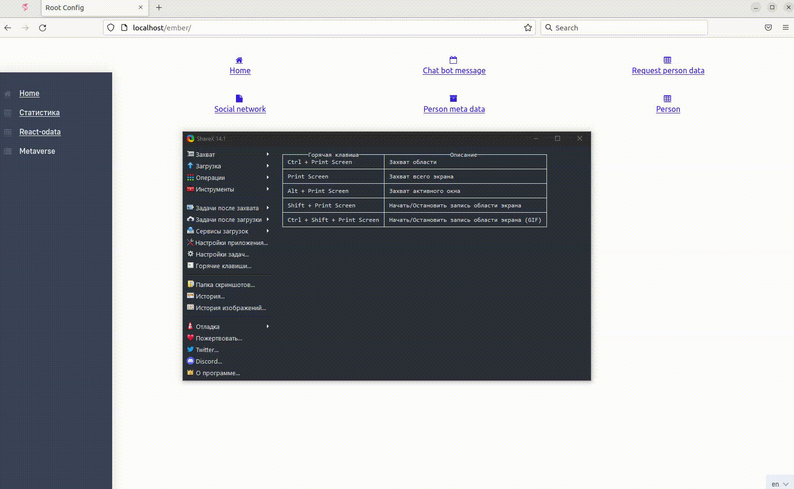

# Flexberry.SingleSpaSample
Приложение демонстрирующее объединение нескольких микрофронтендов при помощи технологии [single-spa](https://single-spa.js.org):


Репозиторий создан с помощью Flexberry Designer (https://designer.flexberry.net)
## Запуск приложения в Docker

Для запуска приложения с БД требуется [Docker](https://docker.com).

Последовательность действий:

1. Собрать Docker-образы
```
\src\Docker> .\create-image.cmd
```

2. Запустить Docker-образы
```
\src\Docker> .\start.cmd
```

Приложение будет доступно по адресу http://localhost

3. Остановить выполнение Docker-образов
```
\src\Docker> .\stop.cmd
```

## Запуск приложения локально
1. Запустить ember-app: `yarn start` в папке `\src\ember-app`
2. Запустить ember-app-navbar: `yarn start` в папке `\src\ember-app-navbar`
3. Запустить react-app: `yarn start` в папке `\src\react-app`
4. Запустить react-app: `yarn start` в папке `\src\react-odata-app`
5. Запустить root-app: `yarn start` в папке `\src\single-spa`
6. Запустить БД: выполнить один из скриптов в папке `\src\SQL` (соответствующий вашей базе)
7. Запустить бекенд: изменить строку соединения `DefConnStr` в Web.config (настроить на вашу базу); запустить с конфигурацией `Debug`.

Фреймворк `single-spa` позволяет некоторые фронтенды загружать с локального сервера (с `serve` и hot-reloading), а некоторые - с сервера (напр. с запущенного докера, где приложение уже опубликовано). Для этого отредактируйте адреса источников в файле `/src/single-spa/src/importmap/importmap.Development.json`.

## Ссылки на документацию

Документация по фреймворку Single SPA: https://single-spa.js.org/docs/getting-started-overview
